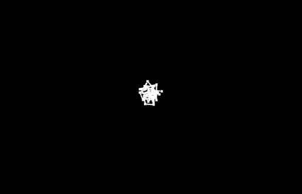

# 3d network graph layout on GPU with Unity
This is a (rough) implementation of a force-directed graph layout algorithm (the Fruchterman-Reingold method) in unity with a compute shader

- tested in unity 2018.1
- not optimized
- uses [Vectrosity](https://assetstore.unity.com/packages/tools/particles-effects/vectrosity-82) to display the graph edges, which is not included here 

